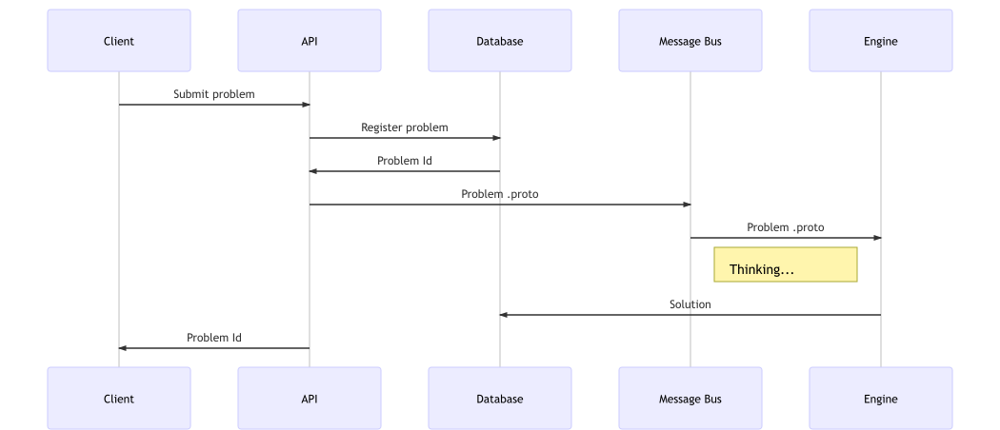
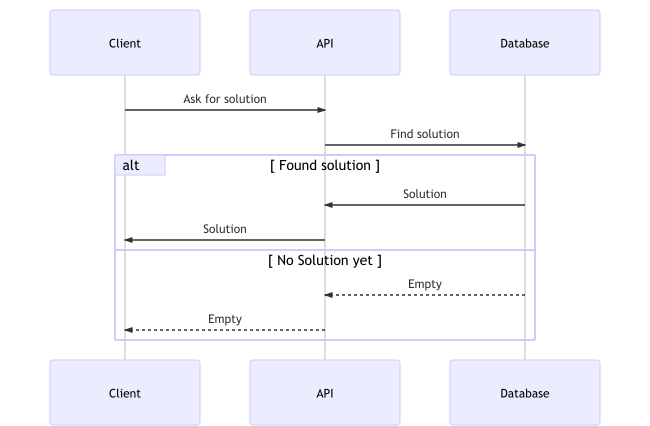

# Knapsack Problem Solving as a Service

## How to run the stack?

#### Prerequisites

A recent version of _Docker_ must be installed and running.

#### Fetch the repository

`git clone git@github.com:cosmincatalin/knapsack-service.git` or `git clone https://github.com/cosmincatalin/knapsack-service.git`

#### Build

* `docker run -v ./knapsack-api:/scala-project cosmincatalin/sbt-assembly` - this will take a few minutes.
* `docker run --rm -v $(pwd):$(pwd) -w $(pwd) znly/protoc --python_out=knapsack-deap/src -I=knapsack-deap/protobuf knapsack-deap/protobuf/knapsack.proto`.

##### Run the solution

* `docker-compose up -d` - to start the stack.
* `docker-compose down` - to stop the stack.

## How to interact with the service?

The _API_ exposes two endpoints. One is used for submitting optimization requests, and the other one is used for fetching solutions.

### Ask to solve an optimization problem.

To make an optimization request you need to make a `POST` request and supply a `JSON` payload with a structure that follows this rule:

```
{
	"volume": <integer>,
	"items": <array> [
    {
      "name": <string>
      "volume": <integer>
      "value": <integer>
    }
	]
}
```

Example: `curl -X POST http://$(docker-machine ip):5000/solve -H 'cache-control: no-cache' -H 'content-type: application/json' -d '{"volume": 15,"items": [{"name": "knife", "volume": 1, "value": 10},{"name": "cup", "volume": 5, "value": 5},{"name": "laptop", "volume": 8, "value": 15},{"name": "phone", "volume": 1, "value": 12},{"name": "adaptor", "volume": 2, "value": 7},{"name": "watch", "volume": 1, "value": 1},{"name": "pants", "volume": 6, "value": 3},{"name": "camera", "volume": 4, "value": 9}]}'`.

On success, the `id` of the problem will be returned. Use this to ask for a solution to the other endpoint. Some typical request errors are being handled and informative messages are being sent back (Eg: a problem with no items.)

### Ask for the solution to a problem

Having the `id` of problem, you can ask for its solution. A solution is a `JSON` with the following schema:

```
{
	"items": <array> [
    {
      "name": <string>
      "volume": <integer>
      "value": <integer>
    }
	]
}
```

Example:

`curl -X GET 'http://'$(docker-machine ip)':5000/solution?id=24fb9e5a-ed4f-41ec-b6d6-a3fb1dc2e184' -H 'cache-control: no-cache'`

If the solution has not been computed yet, status `449` is returned. Also, if the engine decided that a solution won't happen, status `500` will be returned. Anything else is considered as `404`.

## Architecture

#### General Architecture

The architecture that was chosen focuses on flexibility and decoupling of components and concerns. It allows for easy horizontal scaling and is partially resilient as it is (via the message bus). It is a solid foundation for an application that can be auto-scaled in a production environment.

#### API

The frontend to the service is the _API_. It is multithreaded and very light. Its role is just to offload requests to a message bus and handle communication with the clients. It is essentially a proxy to the _engine_.

* Can be scaled horizontally if it is placed behind an autoscaling group.
* It is stateless, meaning that when of a cluster, different instances can serve a single client, without keeping track of sessions. This is also part of the reason while scaling can be done seamlessly.
* It is based on an established high performance

#### Database

The _API_ works with a database where problems are being recorded. Also the _engine_ writes solutions to the same database.

#### Message Bus/Queue

The _API_ forwards work via a _message queue_ (RabbitMQ being the chosen implementation). This allows for some desirable features:

* It enables decoupling between the _engine_ and the _API_.
  * A consequence of that is that the _engine_ can now easily be upgraded or replaced with different implementations in any language, not just JVM based.
* It acts as a buffer for the engine, allowing it to work at it's own pace, albeit with the risk of not keeping it up.
* It allows for the _engine_ to be scaled horizontally based on the size of the queue.
* It allows the _engine_ instances to act as _Competing consumers_, therefor distributing the load.

No special consideration has been made as to have a solid storage for RabbitMQ data. In the context of running docker locally I have chosen to consider messages as volatile. A production system would, of course, require more guarantees. Ideally a service such as _Amazon SQS_ or _Azure Queue Service_.

The _API_ is responsible for creating a queue if it does not exist. The _engine_ expects the queue to exist and will not create it, as it only needs to consume from it and not write to it.

###### Why use Protocol Buffers?

_Protocol Buffers_ is used behind the scenes in the backend of the service. It offers a few benefits:

* Seamless schema evolution. Adding a new field like `maximumNumberOfItems` is handled transparently when being added either from the producer or consumer.
* Less size overhead. While in this specific scenario, size is not a concern, in practice it can become an issue.
* Rich ecosystem of languages supported.
* Works out of the box with binary channels like _RabbitMQ_.

#### Knapsack Engine

The _engine_ is an implementation of the _Genetic Algorithm_ using the _deap_ library package.

* Simple set-up. Receives work from a queue, writes outcomes to a database.
* If it gets killed the rest of the service works fine, albeit with no new solutions being provided.
* Can be replaced by anything else that is able to read from the queue and write to a database.

## A graphical representation

#### Submitting a problem



#### Getting a solution


